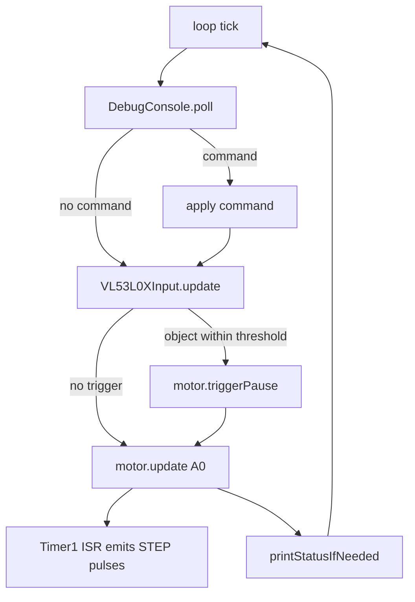
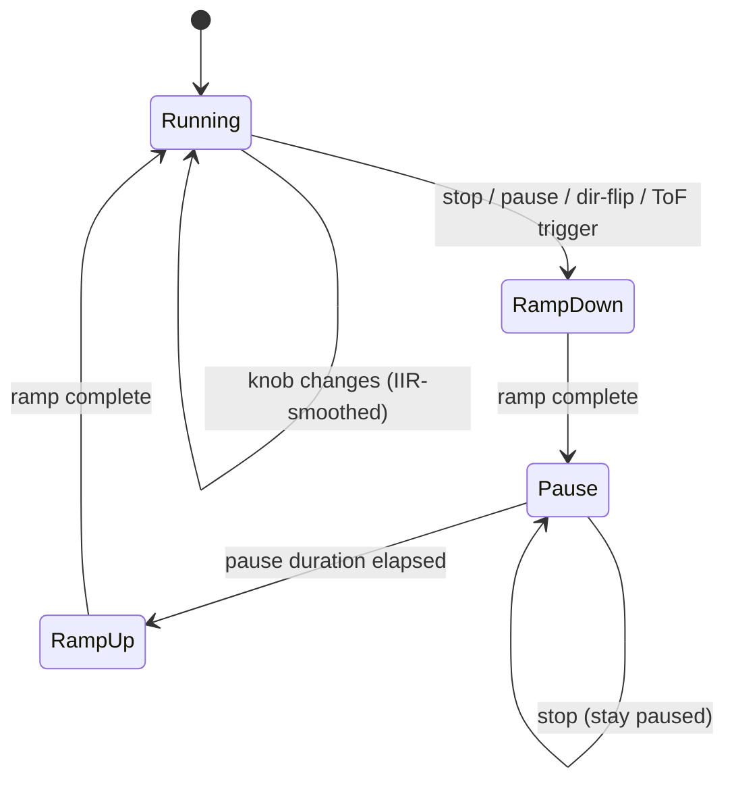

# Hardware & Control Logic

Arduino Nano drives a stepper through an external step/dir driver, takes
manual input from a potentiometer and a pause button, and pauses
automatically when a VL53L0X Time-of-Flight sensor sees something come
close. Telemetry + commands run over USB serial at 115200 baud.

All pin numbers and timing values live in [../nano/Config.h](../nano/Config.h).
Change a value there, `just upload`, and you are done.

## Pinout

| Signal         | Nano pin  | Direction | Notes                                               |
| -------------- | --------- | --------- | --------------------------------------------------- |
| Speed knob     | `A0`      | input     | 10k pot between 5V and GND, wiper → A0              |
| Pause button   | `D2`      | input     | momentary to GND, firmware uses `INPUT_PULLUP`      |
| Stepper STEP   | `D6`      | output    | driven by Timer1 CTC ISR (pin toggled in hardware)  |
| Stepper DIR    | `D7`      | output    | HIGH / LOW selects rotation direction               |
| VL53L0X SDA    | `A4`      | I2C       | standard Nano I2C pin                               |
| VL53L0X SCL    | `A5`      | I2C       | standard Nano I2C pin                               |
| VL53L0X VCC    | 5V (reg)  | power     | VL53L0X breakouts usually have an onboard regulator |
| VL53L0X GND    | GND       | power     |                                                     |
| USB            | USB       | serial    | telemetry + command console, 115200 baud            |

## Wiring

```text
        +5V ──┬── 10k pot ── GND
              │      │
              │      └── wiper ──► A0   (speed knob)
              │
              ├── VL53L0X VCC
              │
              └── (Nano 5V rail)

        GND ──── VL53L0X GND, pot GND, button GND, driver GND

   Pause btn ── D2 ──(to GND when pressed; INPUT_PULLUP)

        D6 ──► driver STEP
        D7 ──► driver DIR
        A4 ──► VL53L0X SDA
        A5 ──► VL53L0X SCL

        USB ──► host (PlatformIO upload / serial monitor)
```

The stepper driver (DRV8825 / A4988 / TMC2209 etc.) handles motor current;
the Nano only produces STEP/DIR logic pulses.

## Firmware modules

| File                                                | Responsibility                                                                                    |
| --------------------------------------------------- | ------------------------------------------------------------------------------------------------- |
| [main.cpp](../nano/main.cpp)                        | `setup()` / `loop()`, wiring between modules, telemetry cadence                                   |
| [Config.h](../nano/Config.h)                        | All tunable pin / timing / filter constants                                                       |
| [MotorController](../nano/MotorController.h)        | Speed mapping, pause FSM, Timer1-driven STEP pulses                                               |
| [ButtonInput](../nano/ButtonInput.h)                | Debounced pause button + one-shot press event                                                     |
| [VL53L0XInput](../nano/VL53L0XInput.h)              | ToF sampling, median/mean filtering, "object coming closer" detection, timeout recovery           |
| [DebugConsole](../nano/DebugConsole.h)              | Serial command parsing + status / event printing                                                  |

## Per-loop pipeline

Each `loop()` tick runs the same fixed pipeline. Order matters: commands
win over sensors, sensors win over the periodic motor update.



## Motor state machine

`MotorController` is a four-state FSM. Ramps are smoothstep-shaped so the
motor never lurches, and a queued direction flip is applied at the
beginning of the next pause so the stepper is stationary when DIR changes.



- `Running` is the only stepping state with full speed; the knob feeds an
  IIR low-pass (`kKnobSlewTauMs`) so rapid twists slew in instead of
  lurching the motor.
- `RampDown` / `RampUp` scale the step interval with smoothstep over
  `kPauseRampMs`.
- `Pause` holds for a random duration picked in
  `[kPauseMinMs, kPauseMaxMs]`. A `pending direction flip` is applied at
  the start of `Pause` so the motor is stationary when DIR toggles.

## Serial console

Commands (one per line, case-insensitive):

| Command               | Effect                                              |
| --------------------- | --------------------------------------------------- |
| `help`                | List commands                                       |
| `status`              | Print one status line now                           |
| `start`               | Enter `RampUp` → `Running`                          |
| `stop`                | Enter `RampDown` → stay in `Pause`                  |
| `pause`               | Trigger one random-length pause cycle               |
| `dir`                 | Queue a direction flip; applied at next pause       |
| `tel on` / `tel off`  | Enable / disable periodic telemetry                 |
| `tel interval <ms>`   | Change the telemetry cadence (min 100 ms)           |

Telemetry status line format (emitted by `DebugConsole::printStatus`):

```text
S state=<state> dir=<0|1> pressed=<0|1> tof_mm=<mm>[(x)] a=<adc> scale=<0..1> step=<steps/s>
```

`(x)` after `tof_mm` means the last ToF read timed out;
`tof_mm=(N/A)` means the sensor failed to initialize.

## VL53L0X filtering

A single raw sample is too noisy to trigger a pause on. The sensor path
is a small three-stage filter:

1. **Raw sample** → rejected if > `kVl53l0xMaxDistanceMm` or sensor timeout.
2. **Median window** (`kVl53l0xMedianCycles`) smooths out outliers.
3. **Mean-of-medians** (`kVl53l0xSmoothCycles`) produces the trend value used
   for "is the object moving closer?" detection.

The motor is paused only when the smoothed trend is monotonically closing
and has been stable for `kVl53l0xMinStableTimeMs`. After
`kVl53l0xRecoveryTimeouts` consecutive timeouts the sensor is re-initialized
to recover from EMI or brownouts.
